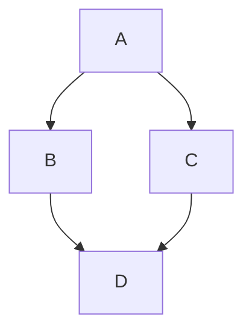

# Contributing to libr0

Thank you for your interest in contributing to libr0!

## Documentation

The documentation is built using [mdBook](https://rust-lang.github.io/mdBook/) and automatically deployed to GitHub Pages when changes are pushed to the main branch.

### Local Preview

To preview the documentation locally:

1. **Install mdBook and preprocessors:**

   ```bash
   cargo install mdbook --version 0.4.52
   cargo install mdbook-svgbob
   cargo install mdbook-mermaid --version 0.14.0
   mdbook-mermaid install
   ```

   **Note:** We use mdBook 0.4.52 specifically for compatibility with the preprocessors.

2. **Build the documentation:**

   ```bash
   mdbook build
   ```

   This generates the HTML site in the `book/` directory.

3. **Serve locally with live reload:**

   ```bash
   mdbook serve
   ```

   This starts a local server at `http://localhost:3000` with automatic rebuilding when files change.

4. **Open in browser:**

   The `serve` command should automatically open your browser. If not, navigate to `http://localhost:3000`.

### Documentation Structure

```
rustlib/
├── book.toml              # mdBook configuration
├── SUMMARY.md             # Table of contents
├── docs/                  # Chapter files
│   ├── 01-option.md
│   ├── 02-result.md
│   └── ...
├── examples/              # Exercise files
└── book/                  # Generated HTML (gitignored)
```

### Diagrams

The documentation supports two types of diagrams:

**ASCII Diagrams (using svgbob):**

````markdown
```bob
┌─────────┐       ┌─────────┐
│ Box<T>  │──────>│    T    │
└─────────┘       └─────────┘
```
````

**Mermaid Diagrams:**

````markdown

````

Both are automatically converted to SVG in the generated documentation.

### Making Changes

1. Edit markdown files in `docs/`
2. Test locally with `mdbook serve`
3. Commit and push to main branch
4. GitHub Actions will automatically build and deploy to GitHub Pages

## Code Contributions

All implementation code is in `src/`. Each chapter has a corresponding module:

- `src/option.rs` - Option0<T>
- `src/result.rs` - Result0<T, E>
- `src/box.rs` - Box0<T>
- And so on...

### Running Tests

```bash
# Run all tests
cargo test

# Run tests for a specific module
cargo test option
cargo test refcell
```

### Running Examples

```bash
# Run a specific example
cargo run --example 01_option
cargo run --example 06_refcell
```

## Questions?

Feel free to open an issue if you have questions or suggestions!